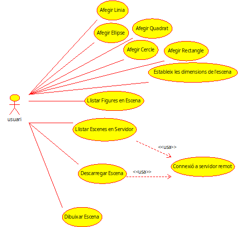

# Diagrama de casos d'ús

El diagrama de casos d'ús de l'aplicació és el següent.

Veiem la descripió de cada cas:

## Cas d'ús: SM00

**Nom**: Afegir quadrat

**Actors**: Usuari

**Descripció**

L'usuari afig un nou quadrat a l'escena.

**Precondicions**:
*cap*

**Seqüència normal**

1. L'usuari introdueix les propietats del quadrat (posició, tamany i color) en la CLI.
2. El sistema afig el quadrat a l'escena i informa l'usuari que s'ha inserit correctament.

**Postcondicions**

S'ha afegit un nou quadrat a l'escena.

**Excepcions**

1.1. Si la sintaxi no es correspon a la del quadrat, mostra un missatge avisant de l'error i mostrant la sintaxi correcta.
1.2. Si la posició del quadrat cau fora de l'àrea de dibuix, mostra un missatge d'error i no l'afig.

## Cas d'ús: SM01

**Nom**: Afegir linia

**Actors**: Usuari

**Descripció**

L'usuari afig dues noves linies a l'escena.

**Precondicions**:
*cap*

**Seqüència normal**

1. L'usuari introdueix les propietats de les linia (posició inicial linia 1, posició final linia 1, posició inicial linia 2, posició final linia 2) en la CLI.
2. El sistema afig la linia a l'escena i informa l'usuari que s'ha inserit correctament.

**Postcondicions**

S'ha afegit dues noves linia a l'escena.

**Excepcions**

1.1. Si la sintaxi no es correspon a la de la linia, mostra un missatge avisant de l'error i mostrant la sintaxi correcta.
1.2. Si  la posicio inicial/final cau fora de l'àrea de dibuix, mostra un missatge d'error i no l'afig.

## Cas d'ús: SM02

**Nom**: Afegir cercle

**Actors**: Usuari

**Descripció**

L'usuari afig un nou cercle a l'escena.

**Precondicions**:
*cap*

**Seqüència normal**

1. L'usuari introdueix les propietats del cercle (posició, radi i color) en la CLI.
2. El sistema afig el cercle a l'escena i informa l'usuari que s'ha inserit correctament.

**Postcondicions**

S'ha afegit un nou cercle a l'escena.

**Excepcions**

1.1. Si la sintaxi no es correspon a la del cercle, mostra un missatge avisant de l'error i mostrant la sintaxi correcta.
1.2. Si la posició del cercle cau fora de l'àrea de dibuix, mostra un missatge d'error i no l'afig.

## Cas d'ús: SM03

**Nom**: Afegir ellipse

**Actors**: Usuari

**Descripció**

L'usuari afig un nou ellipse a l'escena.

**Precondicions**:
*cap*

**Seqüència normal**

1. L'usuari introdueix les propietats del ellipse (posició, amplaria, altura i color) en la CLI.
2. El sistema afig el ellipse a l'escena i informa l'usuari que s'ha inserit correctament.

**Postcondicions**

S'ha afegit un nou ellipse a l'escena.

**Excepcions**

1.1. Si la sintaxi no es correspon a la del ellipse, mostra un missatge avisant de l'error i mostrant la sintaxi correcta.
1.2. Si la posició del ellipse cau fora de l'àrea de dibuix, mostra un missatge d'error i no l'afig.

## Cas d'ús: SM04

**Nom**: Afegir rectangle

**Actors**: Usuari

**Descripció**

L'usuari afig un nou rectangle a l'escena.

**Precondicions**:
*cap*

**Seqüència normal**

1. L'usuari introdueix les propietats del rectangle (posició, tamany i color) en la CLI.
2. El sistema afig el rectangle a l'escena i informa l'usuari que s'ha inserit correctament.

**Postcondicions**

S'ha afegit un nou rectangle a l'escena.

**Excepcions**

1.1. Si la sintaxi no es correspon a la del rectangle, mostra un missatge avisant de l'error i mostrant la sintaxi correcta.
1.2. Si la posició del rectangle cau fora de l'àrea de dibuix, mostra un missatge d'error i no l'afig.

## Cas d'ús: SM05

**Nom**: Estableix les dimensions de l'escena

**Actors**: Usuari

**Descripció**

L'usuari pot redimensiona la grandària en píxels de l'escena.

**Precondicions**:

*cap*

**Seqüència normal**

1. L'usuari afig l'ordre i les noves dimensions de l'escena

**Postcondicions**

Les dimensions de l'escena s'han modificat.

**Excepcions**

1.1. Si la sintaxi no és correcta ho notifca a l'usuari.

## Cas d'ús: SM06

**Nom**: Llistar figures en escena

**Actors**: Usuari

**Descripció**
L'usuari obté un llistat am les diferents figures de l'escena.

**Precondicions**:

*cap*

**Seqüència normal**

1. L'usuari indica l'ordre de llistar l'escena
2. El sistema mostra una descripció de les diferents figures introduïdes a l'escena.

**Postcondicions**

*cap*

**Excepcions**

*cap*

## Cas d'ús: SM07

**Nom**: Llistar Escenes en Servidor

**Actors**: Usuari

**Descripció**

L'usuari obté un llistat de diferents figures emmagatzemades a un servidor extern.

**Precondicions**:
Es requereix d'accés a Internet per poder accedir a servidor (no es comprova prèviament al codi)

**Seqüència normal**

1. L'usuari demana la llista amb l'ordre `remotelist` a la CLI
2. El sistema es connecta al servidor i demana el llistat de fitxers
3. El sistema mostra a l'usuari els diferents fitxers oferits pel servidor

**Postcondicions**
*cap*

**Excepcions**
2.1. Si no hi ha connexió a Internet, el sistema mostrarà un missatge d'error.

## Cas d'ús: SM08

**Nom**: Descarrega Escena

**Actors**: Usuari

**Descripció**

L'usuari demana una escena al servidor, per tal de reemplaçar l'escene actual.

**Precondicions**:

Es requereix d'accés a Internet per poder accedir a servidor (no es comprova prèviament al codi)

**Seqüència normal**

1. L'usuari introdueix l'ordre `get` a la CLI, amb l'escene a decarregar
2. El sistema demana al servidor el fitxer
3. El sistema incorpora les diferents figures a la imatge, informant l'usuari de la correcta inserció.

**Postcondicions**
L'escena s'ha incorporat en el sisema

**Excepcions**
2.1. Si el fitxer no existeix, el sistema mostra nu error en la càrrega del fitxer.
3.1. Si alguna figura no està especificada correctament al fitxer, s'informarà a l'usuari i no s'afegirà a l'escena.

## Cas d'ús: SM09

**Nom**: Dibuixar Escena

**Actors**: Usuari

**Descripció**

Es dibuixa l'escena a una finestra gràfica nova.

**Precondicions**:
*cap*

**Seqüència normal**

1. L'usuari introdueix a la CLI l'ordre `render`
2. El sistema crea una finestra on dibuixa els diferents elements de l'escena.

**Postcondicions**
S'ha creat una nova finestra amb l'escena.

**Excepcions**
*cap*
